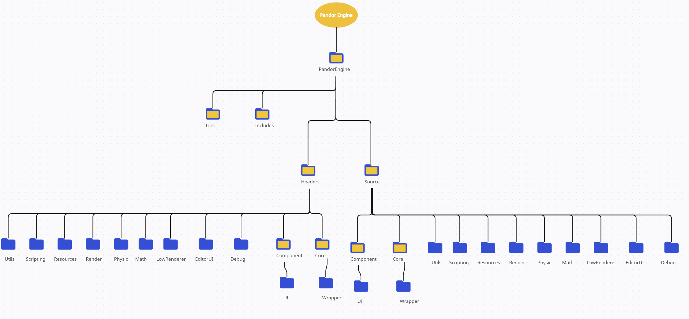

<h1 style="color:cyan" id="section-Head"> Technical Design Document for Pandor Engine</h1>

<h1 style="color:cyan"> Summary </h1>

<ul>
<li><a href="#section-Nomenclature"> Naming convention : </a>
<li><a href="#section-Commentary"> Commentary convention : </a>
<li><a href="#section-OrderClasses"> Order in classes : </a>
<li><a href="#section-NamingConvention"> Class variables and naming convention: </a>
<li><a href="#section-BracketNorms"> Bracket norms : </a>
<li><a href="#section-Namespaces"> Namespaces : </a>
<li><a href="#section-Libraries"> List of libraries : </a>
<li><a href="#section-stbImage"> STB_Image : </a>
<li><a href="#section-ImGui"> Dear ImGui : </a>
<li><a href="#section-Physics"> Physics :  </a>
<li><a href="#section-FbxLoader"> FBX Loader :  </a>
<li><a href="#section-GraphicAPI"> Graphic API: </a>
<li><a href="#section-WindowLib"> Window Library : </a>
<li><a href="#section-FontLib"> Font Library : </a>
<li><a href="#section-TextEditLib"> Text Edit Library : </a>
<li><a href="#section-Sounds"> Sound Library : </a>
<li><a href="#section-scripting"> Scripting Library : </a>
<li><a href="#section-hotreload"> Hot Reload Library : </a>
<li><a href="#section-EngineFeatures"> Engine Core features :  </a>
<li><a href="#section-FolderArchitecture"> Folders Architectures :  </a>
</ul>

  

<h1 style="color:cyan"> Nomenclature </h1> <sameline> 
<a href="#section-Head"> To top of file </a>  

<h3 style="color:yellow" id="section-Nomenclature"> Naming convention : </h3>

<ul>
<li>Fonctions : <t style="color:lime"> SnakeCase 
<li>Variables : <t style="color:orange"> camelCase
<li>public : <t style="color:orange"> camelCase
<li>private : <t style="color:orange"> m_camelCase
<li>protected : <t style="color:orange"> p_camelCase
<li>static : <t style="color:lime"> s_SnakeCase 
</ul>

<h3 style="color:yellow" id="section-Commentary"> Commentary convention : </h3>
To comment the code we decided to always comment before the line or the function except if it's for a variable.  

> Example :  
<t style="color:lime">
/* Comment this function */
</t> 
void FunctionName();
 
int a; <t style="color:lime"> // This variable is used to ...</t>

 
<h3 style="color:yellow" id="section-OrderClasses"> Order in classes : </h3>

Private Variable :  
Protected Variable :   
Public Variable :  
Private Fonction :  
Protected Fonction :   
Public Fonction :  

<h3 style="color:yellow" id="section-NamingConvention"> Class variables and naming convention: </h3>

We will use all variables in private and protected unless it's really necessary to use public and we will add Getters and Setters to the public functions of the class to have control over the acess of every class variables

To name functions , files, folders and namespaces we will always use <t style="color:lime">SnakeCase</t>

<h3 style="color:yellow" id="section-BracketNorms"> Bracket norms : </h3>

Work for functions, if/else , for loop, classes, etc... 

if()  
> one line of code only 

else  
> one line of code only 

if()  
{
> multiple lines of code 

}

else 
{
> one or more line of code 

}

<h3 style="color:yellow" id="section-Namespaces"> Namespaces : </h3>
1 Namespace = 1 folder  

There can also be some specific namespaces inside one of those and thus no specific directory will be created  
We use "Using namespace" only in cpp files and only for the namespace of the file classe but we can also use it for the Maths or Physics namespace if needed  

List of namespaces :
<ul>
<li>Core : everything else
<li>Wrapper : The namespace Wrapper is in Core but allow more precision (then there is one namespace by wrapper in this)
<li>Component : All basics component for the objects  
<li>Math : Math library
<li>Render : Everythink linked to the render, the shaders, openGl , etc..
<li>LowRenderer : For the lights
<li>Resources : Every resources or linked to the Resources Manager
<li>Utils : File loader, parsing, input handler
<li>Physic : Physics Library
<li>Debug : Logs, console, output, asserts
<li>EditorUI : The interface of the engine, like ImGui
<li>Scripting : Handle the function and classes needed for the scripting
</ul>

<h2 style="color:cyan"> Libraries used </h2>
<a href="#section-Head"> To top of file </a>  

<h3 style="color:yellow" id="section-Libraries"> List of libraries : </h3>
<ul>
<li>Graphics API : OpenGL -> <a href="https://docs.google.com/spreadsheets/d/1fXyijKYIah5L2H-D8j5Tq8nMZ_qwe0nkNNSenTW3wBA/edit?usp=sharing"> Link : Wrapper </a>
<li>Interface : Dear ImGui
<li>FBX loader : ofbx 
<li>Texture and image loading : STB Image
<li>Desktop : GLFW
<li>Physics : PhysX
<li>Sound : MiniAudio
<li>Scripting : Mono
<li>Others : 
<ul>
<li> - Font Library : Freetype
<li> - TextEditor : ImGuiColorTextEdit
<li> - Hot Reload : FileWatch 
</ul>
</ul>

<h3 style="color:yellow" id="section-stbImage"> STB_Image : </h3>

<a href="https://github.com/nothings/stb">Link : stb_image </a>

In order to parse the images and textures in the engine we decided to use the stb_image library.  
It's a single file library which make it really easy to use and install in the engine.  
We choose this library because it's a really easy to use library and we already used it a few times so we won't have to learn how to use it.  
We also could have rewrite our own image parser but it would have been time consuming, and it wouldn't be as efficient as stb_image.  

<h3> Difficulties : </h3>

 There was no difficulty with this library since we already used it a lot 

<h3 style="color:yellow" id="section-ImGui"> Dear ImGui : </h3>

<a href="https://github.com/ocornut/imgui/tree/docking"> Link : DearImGUI </a>

For the management of the interface we chose to use the docker version of imgui which allows to have a clear and easy to use interface as well as the possibility to manage the windows as you want and not to be stuck in the main window.

Positives : 
<ul>
<li>ImGui is a library that we have used a lot, so we know how to use it and its different features.
<li>The dock version of ImGui will allow greater flexibility in window positioning.
<li>ImGui is easy to use and to implement
<li>It's a very used and documented library
</ul>

<h3> Difficulties : </h3>

 There was no difficulty with this library since we already used it a lot and we already explored a lot of functionalities 

<h3 style="color:yellow" id="section-Physics">  Physics : </h3>

<a href="https://gameworksdocs.nvidia.com/PhysX/4.1/documentation/physxguide/Index.html"> Link : Physx </a> 
<a href="https://github.com/NVIDIAGameWorks/PhysX"> Link : Physx GitHub </a>

> PhysX

Positive points : 
<ul>
<li>PhysX is multi-platform : Physx and its development kit are available on Microsoft Windows, OS X, Linux, PlayStation 2, PlayStation 3, PlayStation 4, Xbox 360, Xbox One, Wii, Wii U, Android and Apple iOS.
<li>The development kit is free for commercial and non-commercial use on Microsoft Windows, OS X, Linux, Android and Apple iOS.
<li>It is an Open Source library, with a github.
<li>It is a widely used library: it is integrated in several game engines such as Unreal Engine or Unity.
<li>It is also possible to debug physics with a visual debugger: Physical Visual Debugger (PVD).
<li>The PhysX library can be static or dynamic depending on how it is used in a program.
<li>It also has many examples on the github
<li>Romain had the opportunity to use it for a previous project, so he have some experience on it contrary to the Bullet library.
</ul>

Negative points:
<ul>
<li> However, you have to register with Nvidia to download it.
<li> It is heavy in terms of file size (~300 MB of static library)
</ul>

> Bullet 

<a href="https://pybullet.org/wordpress/"> Link : Bullet </a> 
<a href="https://github.com/bulletphysics"> Link : Bullet GitHub </a>

Positive points : 
<ul>
<li> Bullet is an OpenSource library which make it flexible
<li> Bullet works as good on Nvidia than on AMD GPU 
<li> Bullet is really fast to do calculation
</ul>

Negative points:
<ul>
<li> The library hasn't been updated for a long time
<li> Doesn't work well in multithreading 
<li> The documentation is smaller than PhysX
<li> The physics calculation isn't has precise than others physics library
</ul>

> Our choice : PhysX

We decided to use the Physx library, the calculation may be slower but they will be more precise and we already 

<h3> Difficulties : </h3>

 The order of the calls is really important so we need to be very precise with the order of every call 

 We still have some issues with the library, the implementation of physx in the engine requires a lot of time 

<h3 style="color:yellow" id="section-FbxLoader">  FBX Loader : </h3>

<a href="https://github.com/nem0/OpenFBX"> Link : OpenFBX </a>

We decided to use OpenFBX library for loading 3D/animation/textures models in .fbx format

Positive points:
<ul>
<li>It can load geometry (with UVs, normals, tangents, colors), skeletons, animations, blendshapes, materials and textures.
<li>Very easy to install.
<li>Static library, with only 1 ".h" to include.
<li>Very lightweight in terms of file size (474 kb).
<li>I (Romain) have had the opportunity to use it in a previous project, so I am familiar with the library.
<li>Fast loading of resources (0.00375 seconds. for the monkey model).
<li>Provides an example on Github.
<li>It is used in several game engines such as Lumix Engine and Flax Engine.
</ul>

Negative points :
<ul>
<li>Library not well-documented and is not widely used.
<li>It can be complex to understand and use if you have never used an FBX loading library before.
</ul>

<h3> Difficulties : </h3>

 The parsing of the fbx even using a library is really hard and with OpenFBX the parsing of animations and textures was really difficult 

<h3 style="color:yellow" id="section-GraphicAPI"> Graphic API:</h3> 

OpenGL 4.5 vs Vulkan vs DirectX 12

> DirectX 12  

<a href="https://microsoft.github.io/DirectX-Specs/"> Link : DirectX </a>  
First we decided to remove DirectX from the equation due to our lack of experience with it. (We had all chosen Vulkan at the last project).

> Vulkan  

<a href="https://www.vulkan.org/"> Link : Vulkan </a>  
Positives:
<ul>
<li> Developer has great control over all settings and features
<li> Better performance (if setup in an optimized way)
</ul>

Negative points:
<ul>
<li>Little experience (only one project of about 2 weeks)
<li>Long to setup (900 lines just to display a triangle)
<li>Difficult to handle, there are a lot of parameters (this great control implies great responsibilities)
</ul>

> OpenGL  

<a href="https://www.opengl.org/"> Link : OpenGL </a>  
Positives:
<ul>
<li>Lots of experience (about 1 year of practice through various projects)
<li>Simple and fast to use
</ul>

Negative points:
<ul>
<li> Less control and customization which can be very disabling (for optimization for example)
<li> Nowadays OpenGL is not used anymore for big games
</ul>

> OUR CHOICE: OpenGL 

With more experience on Vulkan our choice would have most likely been it.  
This API is much more modern than OpenGL and offers better performance and much more customization. However, with so little practice, we would have had to spend a lot of time to fully master this API in order to really take advantage of its benefits. So we choose OpenGL to save precious time that will allow us to focus on the main features of the Pandor Engine.

<h3> Difficulties : </h3>

 We already use this library a lot so we didn't have a lot of issues to report, for every problem that we had we only had to check in our last projects to find the solution 

<h3 style="color:yellow" id="section-WindowLib"> Window Library : </h3>

We decided to use GLFW for Main Window Rendering instead of SDL2.  
<a href="https://www.glfw.org/"> Link : GLFW </a>  

Positive points : 
<ul>
<li> We have had the opportunity to use it many times, unlike SDL2.
<li> The GLFW library is designed specifically for the creation of OpenGL applications, while SDL2 is a more general multimedia development library. So since it uses OpenGL, GLFW has more optimized and easier features.
<li> It is lighter than SDL2. While SDL2 offers a wide range of features, knowing that we only need the creation of a window, GLFW focuses on the features necessary for the creation of OpenGL applications, which makes its size smaller.
<li> It also is very easy to install and configure, with static or dynamic links to libraries. SDL2 can be a bit more complicated to install and configure, with additional dependencies, which can make it less intuitive to use.
<li> GLFW offers a very efficient cross-platform compatibility. It supports all major platforms, including Windows, macOS and Linux, as well as most mobile platforms.
<li> It also offers excellent online documentation and numerous online examples to facilitate development.
</ul>

Negative Points : 
<ul>
<li> GLFW does not offer high level event management like SDL2 (mouse and keyboard management). 
<li> GLFW does not support reading and writing files, which is a feature that SDL2 offers.
</ul>

  
<h3> Difficulties : </h3>

 The library is easy to use and we already used it a lot so no real problem with this one either 

<h3 style="color:yellow" id="section-FontLib"> Font Library : </h3>
We decided to Use the library freetype to load .ttf files 
<a href="https://freetype.org/"> Link : Font </a> 
Positive points : 
<ul>
<li> It's very simple to use.
<li> Very well explain in LearnOpenGL : https://learnopengl.com/In-Practice/Text-Rendering.
<li> Is Multiplatform.
<li> Still update Frequently.
</ul>

Negative Points : 
<ul>
<li> Large file size for font loading only
</ul>

<h3> Difficulties : </h3>

 There wasn't a lot of problems because learnOpenGL explain this very well. but i still cannot find how to change font Size at runtime 

 
<h3 style="color:yellow" id="section-TextEditLib"> Text Editor Library : </h3>
We choose ImGuiColorTextEdit to do a text Editor in the engine  
This is a header only library to edit script file like '.glsl' file in runtime with syntax highlighting 
Edited by Romain a bit to fit correctly with the engine 
<a href="https://github.com/BalazsJako/ImGuiColorTextEdit"> Link : TextEditor </a>  

<h3 style="color:yellow" id="section-Sounds"> Sound Library : </h3>

We decided to use Miniaudio for the sound of our Engine  
<a href="https://miniaud.io/index.html"> Link : MiniAudio </a>  

Positive points : 
<ul>
<li> The documentation is really big and there is a lot of explanation on how to do the multiple features
<li> The library provide a lot of different functionalities such as spatialization or fading
<li> We know people that already used it so we could get help if needed
</ul>

Negative Points : 
<ul>
<li> Very few tutorials on the web
<li> Not much of example of specific features
</ul>

<h3> Difficulties : </h3>

 There wasn't a lot of problems but due to the lack of tutorials every little problem took a while to fix because we had to find everything and solve everything from 0 with almost no help 
 

<h3 style="color:yellow" id="section-scripting"> Scripting Library : </h3>
For the C# scripting, we knew that it would take a lot of time because of the limited documentation. 
Luckly, we found a recent and well explained tutorial by TheCherno on that subject using the Mono Library. So in order not to waste too much time, we used this library. 
<a href="https://github.com/mono/mono"> Link : Mono </a>  

<h3 style="color:yellow" id="section-hotreload"> HotRealod Library: </h3>
We used filewatch to implement an easier hot reload feature in the engine
This is a header only library that sends events whenever a given file is modified (used for C# scripts hot reload) 
<a href="https://github.com/ThomasMonkman/filewatch"> Link : filewatch </a>  

<h2 style="color:cyan"> Engine Core features : </h2>
<a href="#section-Head"> To top of file </a>  

<h3 style="color:yellow" id="section-EngineFeatures"> Pandor Engine Core feature choice </h3>

We wanted to implement a special feature in our engine that would have works like an instant scene switch to be able to develop level on multiple scene and used those scenes at the same time so the user could have created a game with different style and try a lot of interesting mechanics, but due to a lack of time we didn't have the time to implement this feature in our engine for now.

<h3 style="color:yellow" id="section-FolderArchitecture"> Folders architecture </h3>

  

